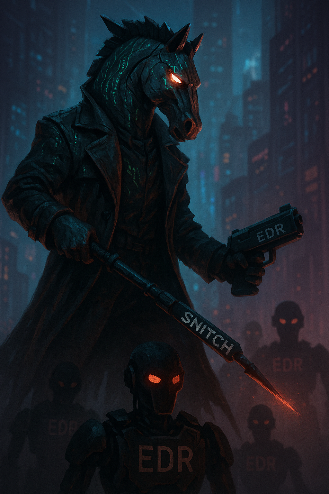

# BYOKSH  Bring Your Own Kernel Snitch Hunter

BYOKSH is a windows rootkit developed with BYOVD(Bring your own vulnerable device) in mind and hate in hearth.

It uses RTCore64.sys vulnerable driver but can easily adapted to every R/W primitive vulnerable drivers by simply implementing a file like the **rtcore.cpp** and adding the communication struct inside utils.h.

Right Now it looks pretty stable, stabler than the Rootkit version(tho it has less functionalities).

# Functionalities

1) Listing and Deleting:
    1) Process operations kernel callbacks.
    2) Thread operations kernel callbacks.
    3) Registry operations kernel callbacks.
    4) Object operations kernel callbacks.
    5) Minifilter operations kernel callbacks (NOT IMPLEMENTED Right now).
2) Disabling Windows Thread Intelligence kernel ETW provider.
3) Bypassing PPL by changing the Protection field of the _EPROCESS struct (Useful for example to bypass lsass dumping protections). (STILL NOT WORKING WITH CredentialGuard ENABLED).
4) Elevating a local process by PID. (Elevates process via Token stealing).
5) Hide a process from the process linked list.

# TO:DO

1) Implementing minifilter callbacks removal.
2) Improving ppl bypass with CredentialGuard bypass.
3) Implementing EDRs termination using another driver or crashing the target process corrupting them.
4) More ETW bypassing.
5) Token downgrade(?)

# Usage

# NOTE:
Since it calculates offsets by downloading pdb of target file from internet, it needs admin privs to get ntoskrnl.exe and also if you need to load the driver it needs to  have admin privs.
